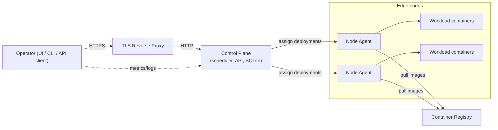
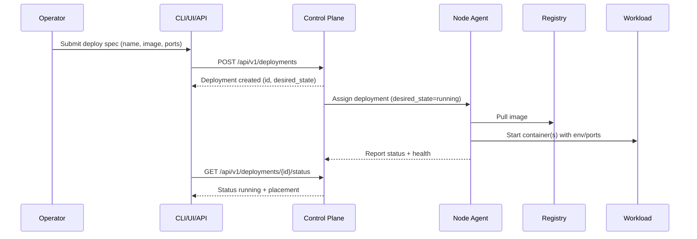

# Architecture Overview

This document provides a high-level view of the Distributed Edge Hosting system architecture.

## System Map

Key points

- Control plane exposes API/UI; TLS is terminated at a reverse proxy.
- Agents connect outbound to the control plane, receive work assignments, and
  pull images from your registry.
- Operator tools (UI/CLI/API) authenticate with operator tokens.

## Deploy flow (happy path)

Where to go next

- Quickstart: [Getting Started](getting-started/index.md)
- Install: [Installation Guide](guides/installation.md)
- Security: [Security Guide](guides/security.md)
- Day-2 ops: [Monitoring Guide](guides/monitoring.md)
