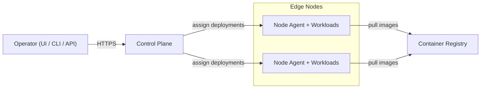

# Overview

## What is Distributed Edge Hosting?

Distributed Edge Hosting (Fledx) is a platform that enables you to run applications on a decentralized infrastructure made
of edge devices, home servers, and micro-cloud nodes. Instead of relying solely on centralized data centers, Fledx
leverages existing compute capacity where it is needed most.

## Vision

> A hosting platform that brings compute to where it is needed – decentralized, efficient, and accessible to everyone.

## Key Benefits

- **Decentralized Architecture** – Compute runs closer to users, devices, and data
- **Use Your Own Hardware** – Reuse existing infrastructure (home labs, SMB servers, edge devices)
- **Self-Healing** – Automatic recovery through redundancy and multi-node architecture
- **Simple Operations** – Opinionated defaults reduce complexity
- **Cost Efficient** – Lower costs by using existing hardware
- **No Vendor Lock-in** – Based on open standards and containers

## Who Is It For?

- **Makers & Prosumers** – Self-host services without expensive cloud bills
- **Small Businesses** – Host applications without dedicated IT teams
- **Edge Integrators** – Build solutions with deterministic latency
- **Industrial Users** – Keep data on-premises for compliance

## Core Components

- **Control Plane** – Orchestration, scheduling, and API/UI
- **Node Agent** – Runs on each edge/home/SMB device
- **Operator Tools** – CLI, Web UI, and REST API
- **Container Runtime** – Docker-based workload deployment

## How It Works

1. Install the control plane on a central host
2. Register edge nodes with the control plane
3. Run node agents on each edge device
4. Deploy containerized applications through CLI, UI, or API
5. The platform automatically schedules and manages workloads

## Architecture Overview

## Next Steps

- **Get Started:** Follow the [Getting Started Guide](getting-started/index.md)
- **Learn More:** Read the [Architecture Documentation](architecture.md)
- **Install:** Set up a [Production Installation](guides/installation.md)
- **Explore:** Check out the [CLI](reference/cli.md), [UI](reference/ui.md), or [API](reference/api.md) reference
